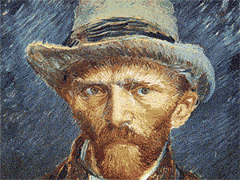

<br>

> [!Warning]  
> Everything published by this user is for informational purposes only and intended for positive, constructive use. Under no circumstances should these projects be used for malicious purposes.

<br>

```cpp
#include <iostream>
#include <cmath>
#include <fstream>

struct State {
    double theta1, omega1;
    double theta2, omega2;
};

struct Params {
    double m1, m2, l1, l2, g;
};

State derivatives(const State &s, const Params &p) {
    double delta = s.theta2 - s.theta1;
    double den1 = (p.m1 + p.m2) * p.l1 - p.m2 * p.l1 * cos(delta) * cos(delta);
    double den2 = (p.l2 / p.l1) * den1;

    double omega1_dot = (p.m2 * p.l1 * s.omega1 * s.omega1 * sin(delta) * cos(delta) +
                        p.m2 * p.g * sin(s.theta2) * cos(delta) +
                        p.m2 * p.l2 * s.omega2 * s.omega2 * sin(delta) -
                        (p.m1 + p.m2) * p.g * sin(s.theta1)) / den1;

    double omega2_dot = (-p.m2 * p.l2 * s.omega2 * s.omega2 * sin(delta) * cos(delta) +
                        (p.m1 + p.m2) * p.g * sin(s.theta1) * cos(delta) -
                        (p.m1 + p.m2) * p.l1 * s.omega1 * s.omega1 * sin(delta) -
                        (p.m1 + p.m2) * p.g * sin(s.theta2)) / den2;

    return {s.omega1, omega1_dot, s.omega2, omega2_dot};
}

State rk4_step(const State &s, const Params &p, double dt) {
    State k1 = derivatives(s, p);
    State s2 = {s.theta1 + 0.5*dt*k1.theta1, s.omega1 + 0.5*dt*k1.omega1,
                s.theta2 + 0.5*dt*k1.theta2, s.omega2 + 0.5*dt*k1.omega2};
    State k2 = derivatives(s2, p);

    State s3 = {s.theta1 + 0.5*dt*k2.theta1, s.omega1 + 0.5*dt*k2.omega1,
                s.theta2 + 0.5*dt*k2.theta2, s.omega2 + 0.5*dt*k2.omega2};
    State k3 = derivatives(s3, p);

    State s4 = {s.theta1 + dt*k3.theta1, s.omega1 + dt*k3.omega1,
                s.theta2 + dt*k3.theta2, s.omega2 + dt*k3.omega2};
    State k4 = derivatives(s4, p);

    return {
        s.theta1 + dt/6*(k1.theta1 + 2*k2.theta1 + 2*k3.theta1 + k4.theta1),
        s.omega1 + dt/6*(k1.omega1 + 2*k2.omega1 + 2*k3.omega1 + k4.omega1),
        s.theta2 + dt/6*(k1.theta2 + 2*k2.theta2 + 2*k3.theta2 + k4.theta2),
        s.omega2 + dt/6*(k1.omega2 + 2*k2.omega2 + 2*k3.omega2 + k4.omega2)
    };
}

int main() {
    Params p = {1.0, 1.0, 1.0, 1.0, 9.81};
    State s = {M_PI/2, 0.0, M_PI/2, 0.0};
    double dt = 0.01;
    int steps = 10000;

    std::ofstream file("double_pendulum.csv");
    file << "theta1,omega1,theta2,omega2\n";

    for(int i = 0; i < steps; ++i) {
        file << s.theta1 << "," << s.omega1 << "," << s.theta2 << "," << s.omega2 << "\n";
        s = rk4_step(s, p, dt);
    }

    file.close();
    return 0;
}
```


